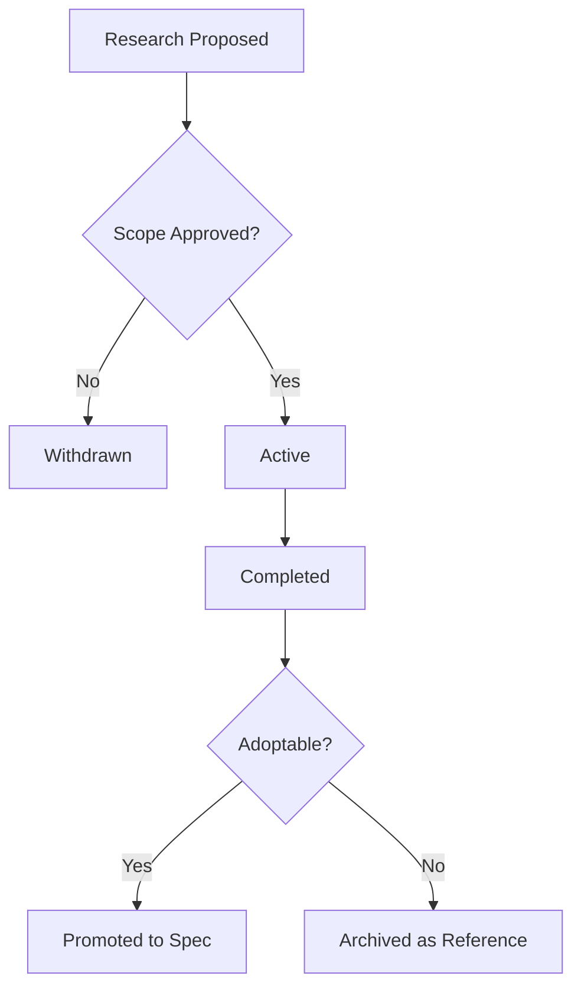

# Research Index

**Version:** 2.0.0
**Updated:** 2026-04-27
**Parent:** [`../00-overview.md`](../00-overview.md)

---

## Overview

Catalog of active research investigations under coding-guidelines. Each entry tracks scope, owner, status, and promotion path to a normative spec.

---

## Inlined Contract

```json
{
  "$schema": "http://json-schema.org/draft-07/schema#",
  "title": "ResearchEntry",
  "type": "object",
  "required": ["id", "title", "owner", "status", "openedAt"],
  "properties": {
    "id":         { "type": "string", "pattern": "^RES-\\d{4}-\\d{3}$" },
    "title":      { "type": "string", "minLength": 5 },
    "owner":      { "type": "string" },
    "status":     { "type": "string", "enum": ["proposed", "active", "completed", "withdrawn", "promoted"] },
    "openedAt":   { "type": "string", "format": "date" },
    "closedAt":   { "type": ["string", "null"], "format": "date" },
    "promotedTo": { "type": ["string", "null"], "description": "spec module relpath if status=promoted" }
  },
  "additionalProperties": false
}
```

---

## Lifecycle Diagram

See [`lifecycle-research-entry.mmd`](./lifecycle-research-entry.mmd) for the complete authoring → validation → publication lifecycle.



---

## Cross-References

| Reference | Location |
|-----------|----------|
| Parent index | [`../00-overview.md`](../00-overview.md) |
| Acceptance criteria | [`./97-acceptance-criteria.md`](./97-acceptance-criteria.md) |
| Lifecycle diagram source | [`./lifecycle-research-entry.mmd`](./lifecycle-research-entry.mmd) |
| Changelog | [`./98-changelog.md`](./98-changelog.md) |
| Consistency report | [`./99-consistency-report.md`](./99-consistency-report.md) |


---

## Example Payload

A canonical entry/instance conforming to the contract above.

```json
{
  "id": "RES-2026-001",
  "title": "Game-engine evaluation: Bevy vs Godot for embedded sims",
  "owner": "research-team",
  "status": "active",
  "openedAt": "2026-04-27"
}
```

---

## Tooling Snippet

CLI usage that authors and reviewers can copy-paste verbatim.

```bash
# List all active research entries
ls 02-coding-guidelines/10-research/ | grep -v '^00\|^9' | sort
```

---

## Verification Checklist

```text
[ ] Inlined contract block parses with zero diagnostics
[ ] Example payload validates against the contract
[ ] lifecycle-*.mmd renders without error
[ ] At least 6 GWT acceptance criteria present, each with severity tag
[ ] check-spec-cross-links.py exits 0 for this folder
[ ] check-tree-health.cjs reports no findings against this folder
```
