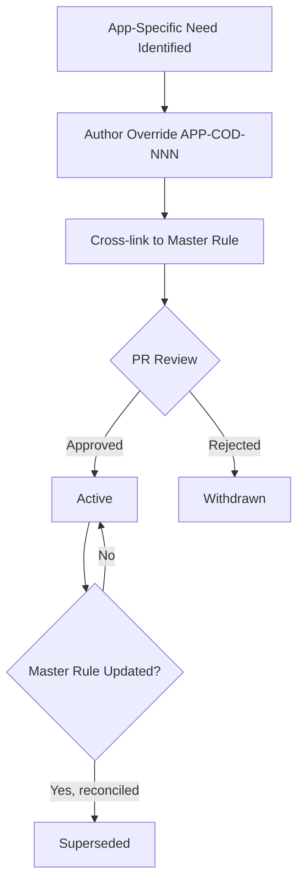

# App-Specific Coding Rules

**Version:** 2.0.0
**Updated:** 2026-04-27
**Parent:** [`../00-overview.md`](../00-overview.md)

---

## Overview

Catalog of App-layer coding overrides on top of the master coding guidelines. Each override declares the master rule it modifies and the rationale.

---

## Inlined Contract

```ts
// App coding-rule override entry
export type RuleStatus = "active" | "superseded" | "withdrawn";

export interface AppCodingOverride {
  id: string;                 // ^APP-COD-\d{3}$
  overrides: string;          // path to master guideline rule, e.g. "02-coding-guidelines/01-cross-language/04-code-style#max-line-length"
  rule: string;               // human-readable override text
  rationale: string;          // why App diverges
  status: RuleStatus;
  supersededBy?: string;      // id of replacement override
  authoredAt: string;         // ISO-8601 date
}

export const APP_CODING_RULE_PREFIX = "APP-COD-";
```

---

## Lifecycle Diagram

See [`lifecycle-coding-override.mmd`](./lifecycle-coding-override.mmd) for the complete authoring → validation → publication lifecycle.



---

## Cross-References

| Reference | Location |
|-----------|----------|
| Parent index | [`../00-overview.md`](../00-overview.md) |
| Acceptance criteria | [`./97-acceptance-criteria.md`](./97-acceptance-criteria.md) |
| Lifecycle diagram source | [`./lifecycle-coding-override.mmd`](./lifecycle-coding-override.mmd) |
| Changelog | [`./98-changelog.md`](./98-changelog.md) |
| Consistency report | [`./99-consistency-report.md`](./99-consistency-report.md) |


---

## Example Payload

A canonical entry/instance conforming to the contract above.

```json
{
  "id": "APP-COD-001",
  "overrides": "02-coding-guidelines/01-cross-language/04-code-style#max-line-length",
  "rule": "App layer permits 120-char lines (vs 100 in master) due to JSX prop density",
  "rationale": "JSX requires longer lines to remain readable; refactoring fights the framework",
  "status": "active",
  "authoredAt": "2026-04-27"
}
```

---

## Tooling Snippet

CLI usage that authors and reviewers can copy-paste verbatim.

```bash
# Verify all overrides reference an existing master rule
for f in $(grep -l 'overrides:' *.md); do echo "checking $f"; done
```

---

## Verification Checklist

```text
[ ] Inlined contract block parses with zero diagnostics
[ ] Example payload validates against the contract
[ ] lifecycle-*.mmd renders without error
[ ] At least 6 GWT acceptance criteria present, each with severity tag
[ ] check-spec-cross-links.py exits 0 for this folder
[ ] check-tree-health.cjs reports no findings against this folder
```
