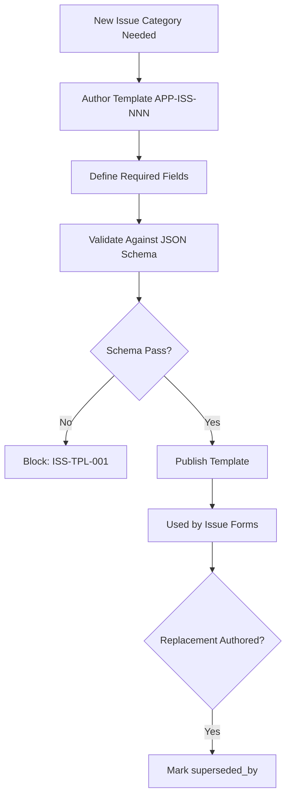

# App Issue Templates

**Version:** 2.0.0
**Updated:** 2026-04-27
**Parent:** [`../00-overview.md`](../00-overview.md)

---

## Overview

Schema-validated issue templates for App-layer bug reports, regressions, and UX defects. Each template enforces required reproduction fields.

---

## Inlined Contract

```json
{
  "$schema": "http://json-schema.org/draft-07/schema#",
  "title": "AppIssueTemplate",
  "type": "object",
  "required": ["id", "category", "fields"],
  "properties": {
    "id":       { "type": "string", "pattern": "^APP-ISS-\\d{3}$" },
    "category": { "type": "string", "enum": ["bug", "regression", "ux-defect", "perf", "a11y"] },
    "fields": {
      "type": "array",
      "minItems": 4,
      "items": {
        "type": "object",
        "required": ["key", "label", "required"],
        "properties": {
          "key":      { "type": "string", "pattern": "^[a-z][a-zA-Z0-9]*$" },
          "label":    { "type": "string" },
          "required": { "type": "boolean" }
        }
      }
    },
    "supersededBy": { "type": ["string", "null"] }
  }
}
```

---

## Lifecycle Diagram

See [`lifecycle-issue-template.mmd`](./lifecycle-issue-template.mmd) for the complete authoring → validation → publication lifecycle.



---

## Cross-References

| Reference | Location |
|-----------|----------|
| Parent index | [`../00-overview.md`](../00-overview.md) |
| Acceptance criteria | [`./97-acceptance-criteria.md`](./97-acceptance-criteria.md) |
| Lifecycle diagram source | [`./lifecycle-issue-template.mmd`](./lifecycle-issue-template.mmd) |
| Changelog | [`./98-changelog.md`](./98-changelog.md) |
| Consistency report | [`./99-consistency-report.md`](./99-consistency-report.md) |
