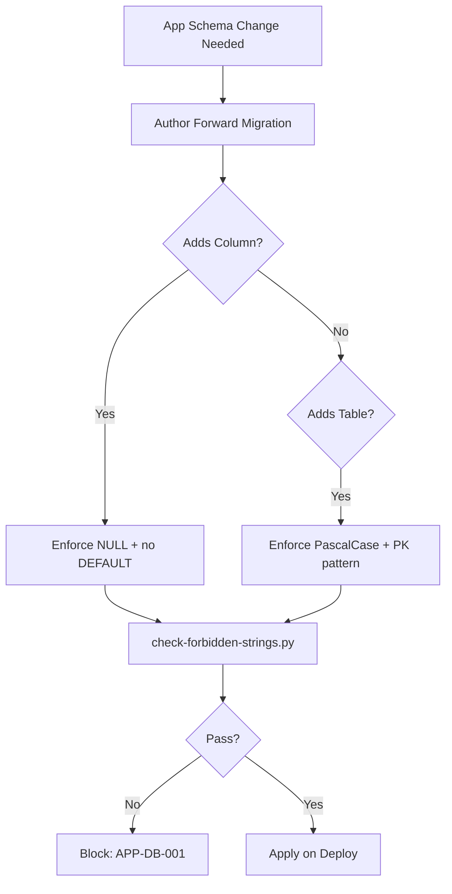

# App Database Conventions

**Version:** 2.0.0
**Updated:** 2026-04-27
**Parent:** [`../00-overview.md`](../00-overview.md)

---

## Overview

App-layer SQL and migration conventions extending the shared database conventions. Enforces forward-only migrations and PascalCase naming for App-owned tables.

---

## Inlined Contract

```sql
-- App-table convention (DDL pattern)
-- Rule 12: forward-only, NULLABLE additions, no DEFAULT, no DROP.
CREATE TABLE AppTableExample (
    AppTableExampleId INTEGER PRIMARY KEY AUTOINCREMENT,
    AppId             INTEGER NOT NULL REFERENCES App(AppId) ON DELETE CASCADE,
    Name              TEXT    NOT NULL,
    CreatedAt         TEXT    NOT NULL,
    UpdatedAt         TEXT    NOT NULL,
    UNIQUE(AppId, Name)
);

-- ALTER pattern for new columns (Phase 69 invariant):
ALTER TABLE AppTableExample ADD COLUMN OptionalNote TEXT NULL;
-- ^ MUST be NULL, MUST NOT have DEFAULT, MUST appear in a new migration file.
```

---

## Lifecycle Diagram

See [`lifecycle-app-migration.mmd`](./lifecycle-app-migration.mmd) for the complete authoring → validation → publication lifecycle.



---

## Cross-References

| Reference | Location |
|-----------|----------|
| Parent index | [`../00-overview.md`](../00-overview.md) |
| Acceptance criteria | [`./97-acceptance-criteria.md`](./97-acceptance-criteria.md) |
| Lifecycle diagram source | [`./lifecycle-app-migration.mmd`](./lifecycle-app-migration.mmd) |
| Changelog | [`./98-changelog.md`](./98-changelog.md) |
| Consistency report | [`./99-consistency-report.md`](./99-consistency-report.md) |


---

## Example Payload

A canonical entry/instance conforming to the contract above.

```sql
-- Example: forward migration adding a column
-- File: migrations/20260427_120000_app_add_optional_note.sql
ALTER TABLE AppTableExample
ADD COLUMN OptionalNote TEXT NULL;

-- Verification query
SELECT name, type, "notnull", dflt_value
FROM pragma_table_info('AppTableExample')
WHERE name = 'OptionalNote';
-- Expect: notnull=0, dflt_value=NULL
```

---

## Tooling Snippet

CLI usage that authors and reviewers can copy-paste verbatim.

```bash
# Run the forbidden-strings linter on App-DB migrations
python3 linter-scripts/check-forbidden-strings.py migrations/
```

---

## Verification Checklist

```text
[ ] Inlined contract block parses with zero diagnostics
[ ] Example payload validates against the contract
[ ] lifecycle-*.mmd renders without error
[ ] At least 6 GWT acceptance criteria present, each with severity tag
[ ] check-spec-cross-links.py exits 0 for this folder
[ ] check-tree-health.cjs reports no findings against this folder
```
