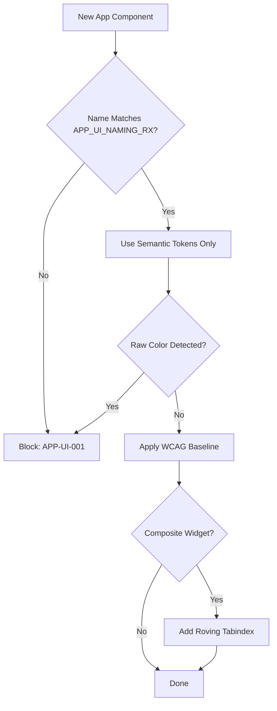

# App UI Conventions

**Version:** 2.0.0
**Updated:** 2026-04-27
**Parent:** [`../00-overview.md`](../00-overview.md)

---

## Overview

App-layer UI naming, composition, and a11y conventions. Enforces PascalCase component names, suffix patterns (Modal, Drawer, Sheet), and WCAG AA baseline.

---

## Inlined Contract

```ts
// App UI convention contract
export type ComponentSuffix = "Modal" | "Drawer" | "Sheet" | "Dialog" | "Popover" | "Toast" | "Banner";

export interface AppComponentConvention {
  /** PascalCase, optionally ending in one of ComponentSuffix */
  name: string;            // ^[A-Z][A-Za-z0-9]*(Modal|Drawer|Sheet|Dialog|Popover|Toast|Banner)?$
  /** WCAG criterion this component must satisfy at minimum */
  wcagBaseline: "AA" | "AAA";
  /** semantic design tokens used (no raw colors permitted) */
  tokens: string[];        // e.g. ["--primary", "--background"]
  /** roving-tabindex required for composite widgets */
  rovingTabindex: boolean;
}

export const APP_UI_NAMING_RX = /^[A-Z][A-Za-z0-9]*(Modal|Drawer|Sheet|Dialog|Popover|Toast|Banner)?$/;
```

---

## Lifecycle Diagram

See [`lifecycle-component-authoring.mmd`](./lifecycle-component-authoring.mmd) for the complete authoring → validation → publication lifecycle.



---

## Cross-References

| Reference | Location |
|-----------|----------|
| Parent index | [`../00-overview.md`](../00-overview.md) |
| Acceptance criteria | [`./97-acceptance-criteria.md`](./97-acceptance-criteria.md) |
| Lifecycle diagram source | [`./lifecycle-component-authoring.mmd`](./lifecycle-component-authoring.mmd) |
| Changelog | [`./98-changelog.md`](./98-changelog.md) |
| Consistency report | [`./99-consistency-report.md`](./99-consistency-report.md) |
