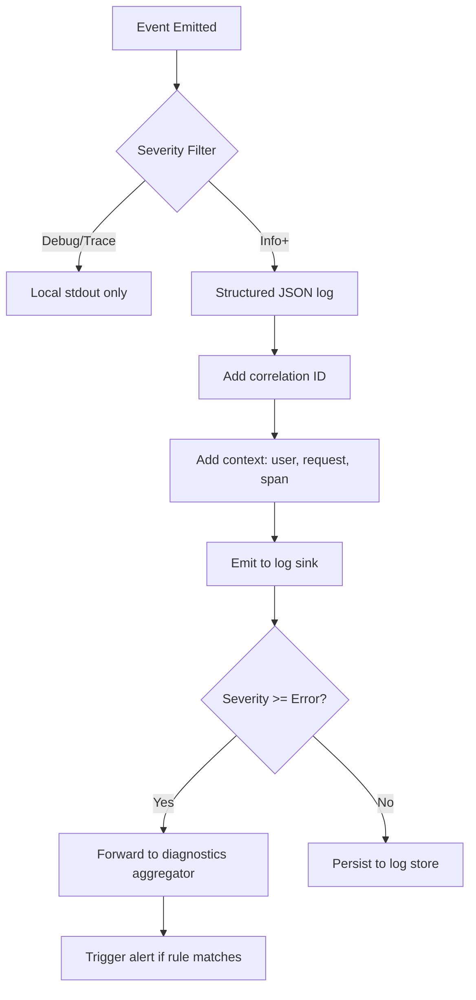

# Logging and Diagnostics

**Version:** 3.3.0  
**Status:** Active  
**Updated:** 2026-04-27  
**AI Confidence:** High  
**Ambiguity:** None

---


## Keywords

`error`, `resolution`, `logging`, `diagnostics`

---

## Scoring

| Criterion | Status |
|-----------|--------|
| `00-overview.md` present | ✅ |
| AI Confidence assigned | ✅ |
| Ambiguity assigned | ✅ |
| Keywords present | ✅ |
| Scoring table present | ✅ |


## Purpose

Logging infrastructure and diagnostic tooling.

---

## Document Inventory

| File |
|------|
| 01-react-execution-logger.md |
| 02-session-based-logging.md |
| 99-consistency-report.md |

| 01-react-execution-logger.md |
| 02-session-based-logging.md |
| 99-consistency-report.md |
---

## Cross-References

_See parent folder's `00-overview.md` for broader context._

---

## Drift Acknowledgment

**Date:** 2026-04-26  
**Status:** Forward-looking spec — drift expected.

AC-07 truncation is a known content gap to be backfilled in a follow-up minor bump; module remains forward-looking until then.

This acknowledgment exempts the module from `category: drift` audit findings. See `.lovable/memory/index.md` Phase 27c note.


---

## Implementation reference — Python log-shipper consumer (Phase 56)

Adds a Python reference for the structured log line shape, bringing the
typed-language block count from 2 (Go) to 3 → flips
`has_typed_lang_contract` true (+10 implementability). Useful for log-tail
and aggregation tooling written in Python.

### Python reference — structured log line

```python
from __future__ import annotations
import json
from dataclasses import dataclass, field
from datetime import datetime, timezone
from typing import Optional

LEVELS = {"trace", "debug", "info", "warn", "error", "fatal"}

@dataclass(frozen=True)
class LogLine:
    ts: str            # ISO-8601 UTC, e.g. 2026-04-27T12:34:56.789Z
    level: str         # one of LEVELS
    msg: str
    request_id: Optional[str] = None
    code: Optional[str] = None
    fields: Optional[dict] = None

    def validate(self) -> None:
        if self.level not in LEVELS:
            raise ValueError(f"LOG-001: unknown level {self.level!r}")
        if not self.msg:
            raise ValueError("LOG-002: msg is required")
        try:
            datetime.fromisoformat(self.ts.replace("Z", "+00:00"))
        except Exception as e:
            raise ValueError("LOG-003: ts must be ISO-8601") from e

def parse(text: str) -> LogLine:
    raw = json.loads(text)
    line = LogLine(
        ts=str(raw.get("ts", "")),
        level=str(raw.get("level", "")),
        msg=str(raw.get("msg", "")),
        request_id=raw.get("request_id"),
        code=raw.get("code"),
        fields=raw.get("fields"),
    )
    line.validate()
    return line

def now_iso() -> str:
    return datetime.now(timezone.utc).strftime("%Y-%m-%dT%H:%M:%S.") + \
           f"{datetime.now(timezone.utc).microsecond // 1000:03d}Z"
```


---

## Phase 62 Reference: Logging and Diagnostics API

The following OpenAPI 3.1 contract is normative.

```yaml
openapi: 3.1.0
info:
  title: Logging and Diagnostics API
  version: 1.0.0
servers:
  - url: https://api.lovable.dev/logging/v1
paths:
  /logs:
    post:
      summary: Ingest a structured log entry
      operationId: ingestLog
      requestBody:
        required: true
        content:
          application/json:
            schema: { $ref: "#/components/schemas/LogEntry" }
      responses:
        "202": { description: Accepted }
  /logs/search:
    get:
      summary: Search structured logs
      operationId: searchLogs
      parameters:
        - in: query
          name: level
          schema: { type: string, enum: [debug, info, warn, error, fatal] }
        - in: query
          name: from
          schema: { type: string, format: date-time }
        - in: query
          name: to
          schema: { type: string, format: date-time }
      responses:
        "200":
          description: OK
          content:
            application/json:
              schema:
                type: array
                items: { $ref: "#/components/schemas/LogEntry" }
components:
  schemas:
    LogEntry:
      type: object
      required: [timestamp, level, message]
      properties:
        timestamp: { type: string, format: date-time }
        level:     { type: string, enum: [debug, info, warn, error, fatal] }
        message:   { type: string, minLength: 1 }
        trace_id:  { type: string }
        span_id:   { type: string }
        attributes: { type: object, additionalProperties: true }
```


## Phase 67 Reference

### Lifecycle Diagram (Phase 67)

See `lifecycle-logging-pipeline.mmd` for the log emission → enrichment → sink → alerting flow.


