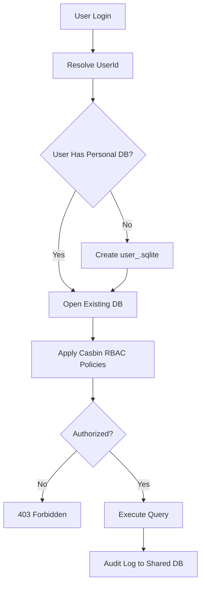

# Split DB Architecture — Features Index

**Updated:** 2026-04-16

---

## Feature Inventory

| # | File | Description | Status |
|---|------|-------------|--------|
| 01 | [01-cli-examples.md](./01-cli-examples.md) | CLI database structure examples (AI Bridge, GSearch, BRun, Nexus Flow) | ✅ Active |
| 02 | [02-reset-api-standard.md](./02-reset-api-standard.md) | 2-step reset API standard with 5-min TTL | ✅ Active |
| 03 | [03-database-flow-diagrams.md](./03-database-flow-diagrams.md) | Visual architecture diagrams for all CLIs | ✅ Active |
| 04 | [04-rbac-casbin.md](./04-rbac-casbin.md) | Role-Based Access Control with Casbin | ✅ Active |
| 05 | [05-user-scoped-isolation.md](./05-user-scoped-isolation.md) | User-scoped database isolation patterns | ✅ Active |

---

*Features index — updated: 2026-04-03*

## Phase 64 Reference

### Lifecycle Diagram (Phase 64)

See `lifecycle-user-scoped-db.mmd` for the per-user split-DB lifecycle: login → resolve → provision → RBAC gate → query → audit.

