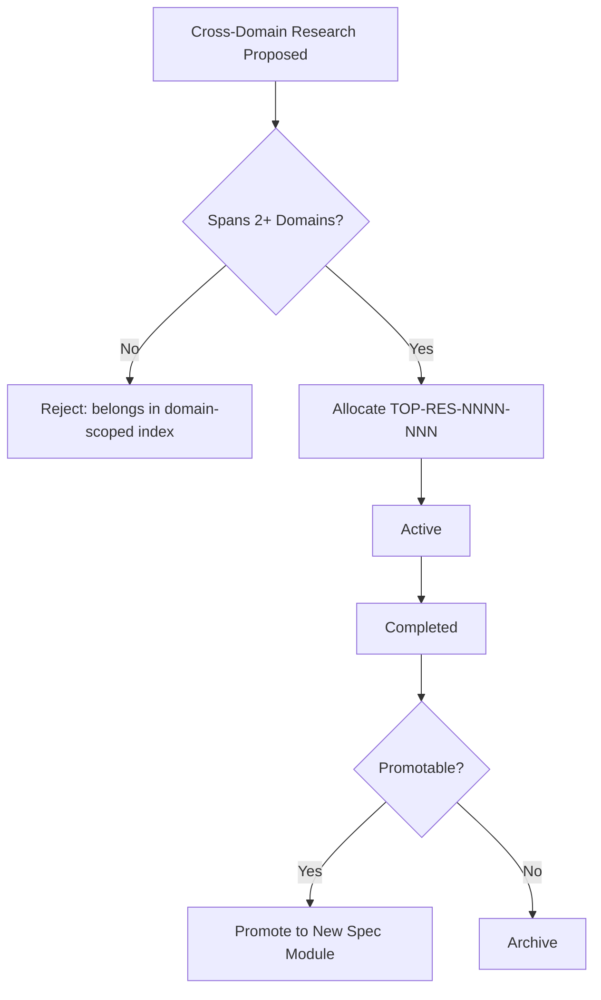

# Top-Level Research Index

**Version:** 2.0.0
**Updated:** 2026-04-27
**Parent:** [`../00-overview.md`](../00-overview.md)

---

## Overview

Top-level research entries that span multiple coding-guideline domains (e.g., game-engine evaluations, framework comparisons). Same schema as the coding-guideline-scoped research index.

---

## Inlined Contract

```json
{
  "$schema": "http://json-schema.org/draft-07/schema#",
  "title": "TopLevelResearchEntry",
  "type": "object",
  "required": ["id", "title", "domains", "owner", "status", "openedAt"],
  "properties": {
    "id":       { "type": "string", "pattern": "^TOP-RES-\\d{4}-\\d{3}$" },
    "title":    { "type": "string", "minLength": 5 },
    "domains":  { "type": "array", "minItems": 2, "items": { "type": "string" }, "description": "MUST be at least 2 spec module relpaths to qualify as top-level" },
    "owner":    { "type": "string" },
    "status":   { "type": "string", "enum": ["proposed", "active", "completed", "withdrawn", "promoted"] },
    "openedAt": { "type": "string", "format": "date" },
    "promotedTo": { "type": ["string", "null"] }
  }
}
```

---

## Lifecycle Diagram

See [`lifecycle-top-research.mmd`](./lifecycle-top-research.mmd) for the complete authoring → validation → publication lifecycle.



---

## Cross-References

| Reference | Location |
|-----------|----------|
| Parent index | [`../00-overview.md`](../00-overview.md) |
| Acceptance criteria | [`./97-acceptance-criteria.md`](./97-acceptance-criteria.md) |
| Lifecycle diagram source | [`./lifecycle-top-research.mmd`](./lifecycle-top-research.mmd) |
| Changelog | [`./98-changelog.md`](./98-changelog.md) |
| Consistency report | [`./99-consistency-report.md`](./99-consistency-report.md) |
