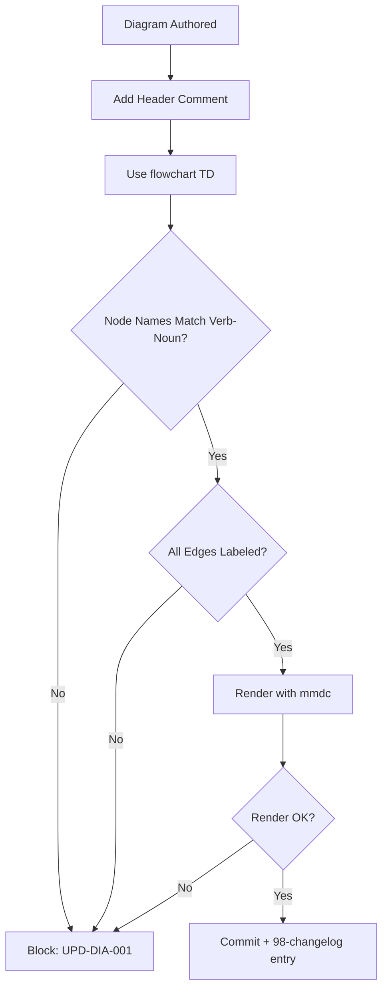
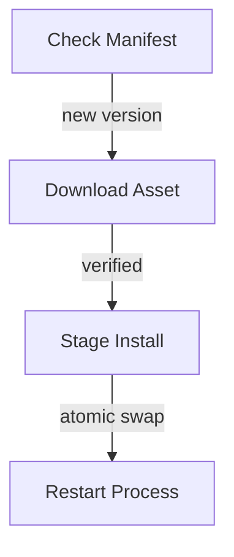

# Update Diagram Conventions

**Version:** 2.0.0
**Updated:** 2026-04-27
**Parent:** [`../00-overview.md`](../00-overview.md)

---

## Overview

Normative conventions for all `14-update/` Mermaid diagrams. Defines node naming, edge labels, severity colors, and required header comments.

---

## Inlined Contract

```ts
// Update-domain diagram conventions
export interface MermaidConvention {
  /** Diagram type — only flowchart TD permitted in 14-update/ */
  type: "flowchart TD";
  /** Node name pattern: must be `[Verb Noun]` */
  nodeNameRx: RegExp;       // /^\[[A-Z][a-z]+ [A-Z][a-z]+(\s[A-Z][a-z]+)?\]$/
  /** Edge labels MUST express the trigger condition or guard */
  requireEdgeLabels: true;
  /** Required header comment with diagram purpose + author */
  headerComment: { purpose: string; author: string; updated: string };
}

export const UPDATE_DIAGRAM_CONVENTION: MermaidConvention = {
  type: "flowchart TD",
  nodeNameRx: /^\[[A-Z][a-z]+(\s[A-Z][a-z]+)+\]$/,
  requireEdgeLabels: true,
  headerComment: { purpose: "", author: "", updated: "" }
};
```

---

## Lifecycle Diagram

See [`lifecycle-diagram-validation.mmd`](./lifecycle-diagram-validation.mmd) for the complete authoring → validation → publication lifecycle.



---

## Cross-References

| Reference | Location |
|-----------|----------|
| Parent index | [`../00-overview.md`](../00-overview.md) |
| Acceptance criteria | [`./97-acceptance-criteria.md`](./97-acceptance-criteria.md) |
| Lifecycle diagram source | [`./lifecycle-diagram-validation.mmd`](./lifecycle-diagram-validation.mmd) |
| Changelog | [`./98-changelog.md`](./98-changelog.md) |
| Consistency report | [`./99-consistency-report.md`](./99-consistency-report.md) |


---

## Example Payload

A canonical entry/instance conforming to the contract above.



---

## Tooling Snippet

CLI usage that authors and reviewers can copy-paste verbatim.

```bash
# Render and verify all 14-update diagrams
for f in spec/14-update/diagrams/*.mmd; do mmdc -i "$f" -o "${f%.mmd}.svg"; done
```

---

## Verification Checklist

```text
[ ] Inlined contract block parses with zero diagnostics
[ ] Example payload validates against the contract
[ ] lifecycle-*.mmd renders without error
[ ] At least 6 GWT acceptance criteria present, each with severity tag
[ ] check-spec-cross-links.py exits 0 for this folder
[ ] check-tree-health.cjs reports no findings against this folder
```
