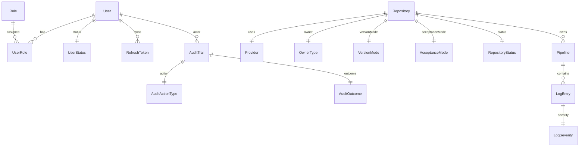

# Database Schema and ERD

**Version:** 1.0.0  
**Updated:** 2026-04-24

---

## Overview

All tables live in the WordPress MySQL database with prefix `{wp_prefix}gitlogs_` (e.g., `wp_gitlogs_User`). Table names are PascalCase, column names are camelCase, every primary key is `INT`/`BIGINT AUTO_INCREMENT` named `{tableName}Id`. Every enum-like value is stored as a foreign key to a lookup table — never as a raw string.

---

## Conventions

| Rule | Detail |
|------|--------|
| Table name | PascalCase singular (`User`, `Repository`, `LogEntry`) |
| Column name | camelCase (`userId`, `createdAt`) |
| PK | `{tableName}Id`, AUTO_INCREMENT |
| FK | `{referencedTableNameInCamel}Id` |
| Enum storage | Lookup table + FK; no `ENUM(...)` column type |
| Timestamps | `createdAt`, `updatedAt` UTC `DATETIME(6)` |
| Charset | `utf8mb4` / `utf8mb4_unicode_ci` |
| Engine | `InnoDB` |

---

## Core Tables

### `User`

| Column | Type | Constraints |
|--------|------|-------------|
| userId | INT | PK, AUTO_INCREMENT |
| username | VARCHAR(64) | UNIQUE, NOT NULL |
| displayName | VARCHAR(128) | NULL |
| email | VARCHAR(255) | NULL |
| tokenHash | VARCHAR(255) | NULL (Argon2id) |
| statusId | TINYINT | FK → `UserStatus.userStatusId`, NOT NULL |
| createdByWpUserId | BIGINT | NULL (set when created via WP bridge) |
| createdAt | DATETIME(6) | NOT NULL |
| updatedAt | DATETIME(6) | NOT NULL |

Indexes: `UNIQUE(username)`, `INDEX(statusId)`.

### `RefreshToken`

| Column | Type | Constraints |
|--------|------|-------------|
| refreshTokenId | BIGINT | PK, AUTO_INCREMENT |
| userId | INT | FK → `User.userId`, NOT NULL |
| tokenHash | VARCHAR(255) | NOT NULL |
| expiresAt | DATETIME(6) | NOT NULL |
| isRevoked | TINYINT(1) | NOT NULL DEFAULT 0 |
| createdAt | DATETIME(6) | NOT NULL |
| rotatedFromId | BIGINT | NULL (FK self) |

Indexes: `INDEX(userId, isRevoked)`, `INDEX(expiresAt)`.

### `Repository`

| Column | Type | Constraints |
|--------|------|-------------|
| repositoryId | INT | PK, AUTO_INCREMENT |
| providerId | TINYINT | FK → `Provider.providerId` |
| ownerTypeId | TINYINT | FK → `OwnerType.ownerTypeId` |
| ownerName | VARCHAR(128) | NOT NULL |
| repoName | VARCHAR(128) | NOT NULL |
| versionModeId | TINYINT | FK → `VersionMode.versionModeId` |
| acceptanceModeId | TINYINT | FK → `AcceptanceMode.acceptanceModeId` |
| logSenderTokenHash | VARCHAR(255) | NOT NULL |
| statusId | TINYINT | FK → `RepositoryStatus.repositoryStatusId` |
| createdAt | DATETIME(6) | NOT NULL |
| updatedAt | DATETIME(6) | NOT NULL |

Indexes: `UNIQUE(providerId, ownerName, repoName)`, `INDEX(ownerName)`, `INDEX(statusId)`.

### `Pipeline`

| Column | Type | Constraints |
|--------|------|-------------|
| pipelineId | INT | PK, AUTO_INCREMENT |
| repositoryId | INT | FK → `Repository.repositoryId` |
| branchName | VARCHAR(255) | NOT NULL |
| pipelineName | VARCHAR(255) | NOT NULL |
| createdAt | DATETIME(6) | NOT NULL |

Indexes: `UNIQUE(repositoryId, branchName, pipelineName)`, `INDEX(repositoryId, branchName)`.

### `LogEntry`

| Column | Type | Constraints |
|--------|------|-------------|
| logEntryId | BIGINT | PK, AUTO_INCREMENT |
| pipelineId | INT | FK → `Pipeline.pipelineId` |
| commitSha | CHAR(40) | NULL |
| severityId | TINYINT | FK → `LogSeverity.logSeverityId` |
| message | MEDIUMTEXT | NOT NULL |
| metadataJson | JSON | NULL |
| occurredAt | DATETIME(6) | NOT NULL |
| createdAt | DATETIME(6) | NOT NULL |

Indexes: `INDEX(pipelineId, occurredAt)`, `INDEX(severityId)`, `INDEX(commitSha)`.

### `AuditTrail`

| Column | Type | Constraints |
|--------|------|-------------|
| auditTrailId | BIGINT | PK, AUTO_INCREMENT |
| actorUserId | INT | FK → `User.userId`, NULL (no-auth push) |
| actorWpUserId | BIGINT | NULL (WP bridge) |
| actionTypeId | TINYINT | FK → `AuditActionType.auditActionTypeId` |
| endpointPath | VARCHAR(255) | NOT NULL |
| httpMethod | VARCHAR(8) | NOT NULL |
| requestIp | VARCHAR(45) | NOT NULL |
| outcomeId | TINYINT | FK → `AuditOutcome.auditOutcomeId` |
| httpStatus | SMALLINT | NOT NULL |
| detailsJson | JSON | NULL |
| createdAt | DATETIME(6) | NOT NULL |

Indexes: `INDEX(createdAt)`, `INDEX(actionTypeId)`, `INDEX(outcomeId)`, `INDEX(actorUserId)`.

### `UserRole` (n-m)

| Column | Type | Constraints |
|--------|------|-------------|
| userRoleId | INT | PK, AUTO_INCREMENT |
| userId | INT | FK → `User.userId` |
| roleId | TINYINT | FK → `Role.roleId` |

Indexes: `UNIQUE(userId, roleId)`.

---

## Lookup Tables (Enum-Backed)

Each lookup table follows the shape `{ {tableName}Id TINYINT PK AUTO_INCREMENT, name VARCHAR(64) UNIQUE NOT NULL }`. They are seeded on plugin activation.

| Table | Seeded Values |
|-------|---------------|
| `UserStatus` | `Active`, `Suspended`, `Revoked` |
| `Role` | `Admin`, `CanAddRepo`, `CanAddUser`, `CanViewLogs`, `CanPushLogs` |
| `Provider` | `GitHub`, `GitLab` (reserved) |
| `OwnerType` | `User`, `Organization` |
| `VersionMode` | `Exact`, `Wildcard` |
| `AcceptanceMode` | `RepoUrl`, `OwnerWildcard` |
| `RepositoryStatus` | `Active`, `Disabled` |
| `LogSeverity` | `Trace`, `Debug`, `Info`, `Warn`, `Error`, `Fatal` |
| `AuditActionType` | (see [01-glossary-and-enums.md](./01-glossary-and-enums.md)) |
| `AuditOutcome` | `Success`, `Rejected`, `Error` |

---

## Entity Relationship Diagram

---

## Retention

Per locked decision: log retention is **indefinite** in v1. No scheduled deletion job. A future module may introduce rolling retention via `wp-cron`.

---

## Cross-References

- [01-glossary-and-enums.md](./01-glossary-and-enums.md) — Enum value definitions
- [10-audit-trail.md](./10-audit-trail.md) — Audit write rules
- [../04-database-conventions/00-overview.md](../04-database-conventions/00-overview.md) — Cross-module DB conventions
